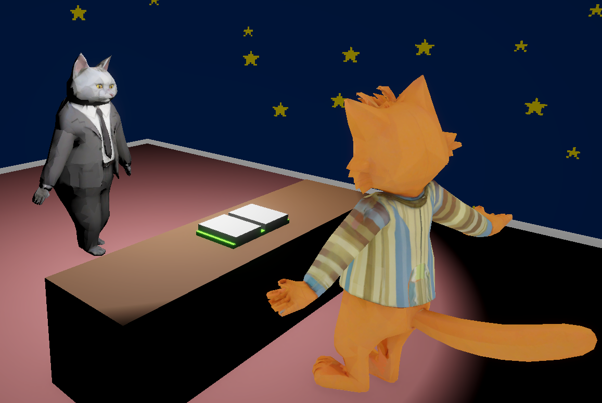

# 🏛️ Parliament Hero

**Parliament Hero** is an educational role-playing game that places players in the heart of the European democratic process. It teaches critical civic skills such as identifying disinformation, researching laws, and making informed decisions — all through an engaging game loop based on real EU values, structures, and challenges.

<!-- TODO: picture -->

## 🎯 What You'll Learn

Through interactive missions and dynamic NPC interactions, players will explore:

- 📜 The role and responsibilities of the European Parliament  
- 🗳️ The importance of civic participation and **informed** voting  
- 🕵️ Strategies to recognize, **prebunk**, and debunk disinformation through research and critical thinking  

---

## 🟦🟨🟩🟥 Factions: Choose Your Democratic Identity

Players align with one of four democratic **factions**, which reflect the diversity of ideologies in the European Parliament:

- 🟦 **Traditionalists** – heritage, stability, national identity  
- 🟨 **Liberals** – individual freedoms, market economy, reform  
- 🟩 **Greens** – sustainability, climate action, social justice  
- 🟥 **Progressives** – innovation, equality, inclusive growth  

Each faction provides a lens through which players view new laws, debates, and decision-making. Factions influence your gameplay, alliances, and ultimate reputation.

<!-- TODO: picture -->

---

## 🔁 Gameplay Loop: The Four Steps of Democracy

### 🧾 Step 1 – A Law Appears  

Each round begins with a new **law proposal** from one of the major policy areas. These laws simulate **real-life situations** where people may only hear headlines or partial information — and must decide what to do next.

NPCs react immediately, with **mood bars** showing their opinions. These quick impressions mimic how real citizens and politicians may initially react without full context. It’s now up to the player to learn more.

➡️ This step highlights **the challenge of limited knowledge** and encourages curiosity, skepticism, and further inquiry.

<!-- TODO: picture -->

---

### 🏢 Step 2 – The Office  

Players are then placed in a more interactive environment: the **Office**, where they meet a variety of individuals and institutions who present their opinions or lobby for or against proposed laws.

This mirrors **day-to-day real-world information exposure**: news articles, conversations, influencers, and social media posts.  

Some of these sources are trustworthy — others are not.

Players must:
- Examine biases and political inclinations
- Distinguish between reliable and unreliable information
- Begin to suspect potential disinformation or manipulation

➡️ This stage develops **information filtering** and teaches players to question sources before accepting them as fact.

<!-- TODO: picture -->

---

### 📚 Step 3 – The Library  

This is the **debunking and prebunking** phase. Players take a deep dive into information: reading books, comparing media sources, and using online tools inside the Library.

Tools available:
- 📖 Click bookshelves to access historical context and data  
- 💻 Use the laptop to simulate online research  

Players are **encouraged to consult multiple sources**, compare conflicting narratives, and draw their own conclusions. Critical thinking is essential — and rewarded.

➡️ This phase teaches **media literacy** and **source triangulation**, helping players learn to verify before acting.

All these steps are repeated multiple times until an ending in reached.

<!-- TODO: picture -->

---

### 🎬 Endings – Your Votes Shape the World

After a predefined number of rounds, the game concludes with one of five possible endings based on the player's voting patterns and factional influence:
* 🟦 A Traditionalist ending (Traditionalists had the most power)
* 🟨 A Liberal ending
* 🟩 A Green ending
* 🟥 A Progressive ending
* ⚖️ A **Harmony ending** – where all factions held similar influence
This outcome depends on:

The faction you supported most through votes

The NPCs you interacted with and influenced

The laws you chose to support or reject

➡️ At this final point, the game highlights a key civic message:
**Every vote matters. Every interaction counts.**

Players reflect on how their individual choices shaped the political landscape, emphasizing the **importance of participation, presence, and informed decision-making** in a democracy.

---

### 🗳️ Step 4 – Voting Time  

With everything they've seen and researched, players now face the final decision: **vote yes or no on the proposed law**.

They must consider:
- Public mood
- Faction alignment
- What they uncovered in the Library
- Long-term effects on their reputation and future laws

Every vote matters and will influence how factions treat you, how the public views your performance, and how future laws develop.

➡️ This step emphasizes the **power and responsibility of voting**, and the need to make informed, self-driven choices — not emotional or misled ones.

<!-- TODO: picture -->

---

## 🧠 Mechanics & Game Framework

To manage the complex interplay of factions, laws, NPCs, and outcomes, we've developed robust Unity-based tools. These make our game not just a one-time experience, but a **reusable educational framework**:

### 🔧 1. **NPC Creator Component**
Create new NPCs and define:
- Political orientation  
- Visuals, names, traits  
- Behavior profiles (how they’ll react to laws)

This allows easy plug-and-play use later without coding.

### 💬 2. **NPC Interaction Creator**
Used for defining:
- Dialogue trees between player and NPC  
- Reactions and consequences for yes/no choices  
- Political leanings and intensity of influence  

All interactions used in Step 2 (Office) are built here.

### 🏛️ 3. **Law Manager**
Used to:
- Add new law proposals  
- Define their title, description, icon  
- Attach effects and NPC reactions  
- Link to existing NPC interactions

---

These tools combine to make **Parliament Hero a full game framework**, not just a single-use product. With no programming required and only a short tutorial, educators or developers can:

- Replace content with new topics (e.g., climate policy, human rights)
- Build custom games for other democratic systems
- Scale and reuse the platform for other audiences  

➡️ Our goal is to support **repeatable, adaptable educational experiences** accessible to all ages.

---

## 📚 Educational Impact

**Parliament Hero** delivers powerful learning outcomes by blending real EU content with fun, interactive storytelling:

- 🧠 Understanding of democratic institutions and law-making  
- 🔎 Skills in research, evidence comparison, and narrative analysis  
- 🗳️ Empowerment through knowledge of how and why to vote  
- 🧍 Awareness of personal biases and the manipulation of information  

All while staying **approachable for young learners** and **meaningful for adults**.

---

## ⚠️ Challenges We Faced

Designing **Parliament Hero** came with important challenges:

### 🧩 Gamifying Real Processes  
- Turning complex, dry procedures into accessible and entertaining mechanics  
- Balancing fun with educational value  

### 🔄 Managing Complexity  
- Simulating political diversity with dynamic NPC behavior  
- Maintaining consistent logic across numerous interactions  

### 🧠 Pedagogical Alignment  
- Ensuring each decision teaches a real-world skill  
- Designing systems that promote **learning by doing**, not lecturing  

<!-- TODO: picture -->

### 🧪 Disinformation Design  
- Creating misleading but **realistic** fake news examples  
- Encouraging skepticism without promoting cynicism or conspiracy thinking  

<!-- TODO: picture -->

### 🧰 Framework Modularity  
- Making tools robust enough for reusability, yet simple for non-programmers  
- Balancing flexibility and structure in the Unity Editor

<!-- TODO: picture -->

---

> 🗳️ **Your vote is your voice. Your knowledge is your shield.**  
> Learn. Think. Decide. Be a Parliament Hero.

<!-- TODO: picture -->
