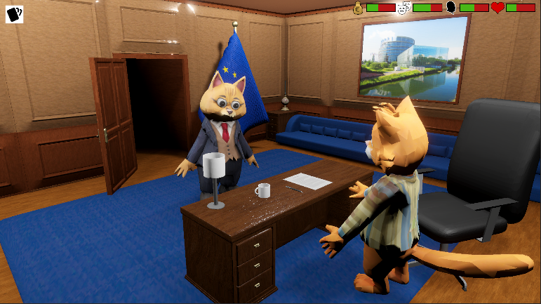

# 🏛️ Parliament Hero

**Parliament Hero** is an educational role-playing game that places players in the heart of the European democratic process. It teaches critical civic skills such as identifying disinformation, researching laws, and making informed decisions — all through an engaging game loop based on real EU values, structures, and challenges.

## 🔗 Quick Links

- ▶️ [Gameplay video (30s)](https://www.youtube.com/watch?v=P4574rxH_3g)
- 🎤 [Vocal presentation (Romanian, ~20 min)](https://youtu.be/CRRVehBTh9k) — design, thinking process, and decision making
- 💻 [Source code on GitHub](https://github.com/deprimus/CodeForEurope)
- 📝 [Web content editor (JSON)](https://deprimus.github.io/CodeForEurope/) — edit `game_database.json` in the browser  
- 🎮 [Play on itch.io](https://unexomwid.itch.io/parliament-hero)

---

## 📑 Table of Contents

- [🏛️ Parliament Hero](#️-parliament-hero)
  - [🔗 Quick Links](#-quick-links)
  - [📑 Table of Contents](#-table-of-contents)
  - [🎯 What You'll Learn](#-what-youll-learn)
  - [🌈 Value perspectives: democratic orientations](#-value-perspectives-democratic-orientations)
  - [🔁 Gameplay Loop: The Four Steps of Democracy](#-gameplay-loop-the-four-steps-of-democracy)
    - [🧾 Step 1 – A Law Appears](#-step-1--a-law-appears)
    - [🏢 Step 2 – The Office](#-step-2--the-office)
    - [📚 Step 3 – The Library](#-step-3--the-library)
    - [🎬 Endings – Your Votes Shape the World](#-endings--your-votes-shape-the-world)
    - [🗳️ Step 4 – Voting Time - Going back to step 1](#️-step-4--voting-time---going-back-to-step-1)
  - [🧠 Mechanics \& Game Framework](#-mechanics--game-framework)
    - [🌐 Web content editor (JSON)](#-web-content-editor-json)
    - [🔧 1. **NPC Creator (Unity)**](#-1-npc-creator-unity)
    - [💬 2. **NPC Interaction Creator**](#-2-npc-interaction-creator)
    - [🏛️ 3. **Law Manager \& welfare indicators**](#️-3-law-manager--welfare-indicators)
    - [🗃️ 4. **Game data (`game_database.json`)**](#️-4-game-data-game_databasejson)
  - [📖 Code \& Tooling Documentation](#-code--tooling-documentation)
  - [📚 Educational Impact](#-educational-impact)
  - [🧑‍🏫 Techniques \& Educational Design](#-techniques--educational-design)
  - [⚠️ Challenges We Faced](#️-challenges-we-faced)
    - [🧩 Gamifying Real Processes](#-gamifying-real-processes)
    - [🔄 Managing Complexity](#-managing-complexity)
    - [🧠 Pedagogical Alignment](#-pedagogical-alignment)
    - [🧪 Disinformation Design](#-disinformation-design)
    - [🧰 Framework Modularity](#-framework-modularity)
- [🔮 Future Plans](#-future-plans)
- [🎵 Assets](#-assets)
  - [🔊 Audio](#-audio)
  - [🧊 3D Models](#-3d-models)
  
---

## 🎯 What You'll Learn

Through interactive missions and dynamic NPC interactions, players will explore:

- 📜 The role and responsibilities of the European Parliament  
- 🗳️ The importance of civic participation and **informed** voting  
- 🕵️ Strategies to recognize, **prebunk**, and debunk disinformation through research and critical thinking  

---

## 🌈 Value perspectives: democratic orientations

Players engage with four broad **value perspectives** that reflect the diversity of views in the European Parliament (in code and data these map to orientation types; the goal is inclusive framing in learning materials):

- 🟦 **Traditionalist** – heritage, stability, continuity  
- 🟨 **Libertarian / liberal** – individual freedoms, market economy, reform  
- 🟩 **Left / green** – sustainability, climate action, social justice  
- 🟥 **Right / progressive** – innovation, equality, inclusive growth  

Each perspective offers a lens for laws, debates, and choices. How you vote and whom you listen to shapes relationships and outcomes—not a single “correct” ideology, but informed trade-offs.

---

## 🔁 Gameplay Loop: The Four Steps of Democracy

### 🧾 Step 1 – A Law Appears  

Each round begins with a new **law proposal** from one of the major policy areas. These laws simulate **real-life situations** where people may only hear headlines or partial information — and must decide what to do next.

NPCs react immediately, with **mood bars** showing their opinions. These quick impressions mimic how real citizens and politicians may initially react without full context. It’s now up to the player to learn more.

➡️ This step highlights **the challenge of limited knowledge** and encourages curiosity, skepticism, and further inquiry.

---

### 🏢 Step 2 – The Office  

Players are then placed in a more interactive environment: the **Office**, where they meet a variety of individuals and institutions who present their opinions or lobby for or against proposed laws.

This mirrors **day-to-day real-world information exposure**: news articles, conversations, influencers, and social media posts.  

Some of these sources are trustworthy — others are not.

Players must:
- Examine biases and stated viewpoints
- Distinguish between reliable and unreliable information
- Begin to suspect potential disinformation or manipulation

➡️ This stage develops **information filtering** and teaches players to question sources before accepting them as fact.

👉 [View "Step Two" as a GIF (opens in new tab)](https://static.exom.dev/parliamenthero/level2.gif)

---

### 📚 Step 3 – The Library  

This is the **debunking and prebunking** phase. Players take a deep dive into information: reading books, comparing media sources, and using online tools inside the Library.

Tools available:
- 📖 Click bookshelves to access historical context and data  
- 💻 Use the laptop to simulate online research  

Players are **encouraged to consult multiple sources**, compare conflicting narratives, and draw their own conclusions. Critical thinking is essential — and rewarded.

➡️ This phase teaches **media literacy** and **source triangulation**, helping players learn to verify before acting.

All these steps are repeated multiple times until an ending in reached.

---

### 🎬 Endings – Your Votes Shape the World

After a predefined number of rounds, the game concludes with one of five possible endings based on the player's voting patterns and how **orientation influence** shifted:
* 🟦 A Traditionalist-leaning ending  
* 🟨 A liberal-leaning ending  
* 🟩 A green / left-leaning ending  
* 🟥 A progressive / right-leaning ending  
* ⚖️ A **Harmony ending** – where influence was relatively balanced across perspectives  
  
This outcome depends on:
- Which perspectives you supported most through votes  
- The NPCs you interacted with and influenced  
- The laws you chose to support or reject  
- **Societal indicators** (economy, inequality, education, health) tracked via welfare effects

➡️ At this final point, the game highlights a key civic message:
**Every vote matters. Every interaction counts.**

Players reflect on how their individual choices shaped the political landscape, emphasizing the **importance of participation, presence, and informed decision-making** in a democracy.

---

### 🗳️ Step 4 – Voting Time - Going back to step 1

With everything they've seen and researched, players now face the final decision: **vote yes or no on the proposed law**.

They must consider:
- Public mood  
- Alignment with different value perspectives  
- What they uncovered in the Library  
- Long-term effects on reputation, **societal indicators**, and future laws  

Every vote matters and will influence how characters respond, how the public views your performance, and how future laws develop.

➡️ This step emphasizes the **power and responsibility of voting**, and the need to make informed, self-driven choices — not emotional or misled ones.

---

## 🧠 Mechanics & Game Framework

To manage the interplay of laws, NPCs, value perspectives, **societal welfare indicators**, and outcomes, we combine Unity editor tools with a **data-driven JSON pipeline**. Together they make the project a **reusable educational framework**.

### 🌐 Web content editor (JSON)

**Live editor:** [CodeForEurope Data Editor](https://deprimus.github.io/CodeForEurope/) — a static, browser-only tool to load `game_database.json`, edit structured content with guidance, and download a compatible file. Nothing is uploaded; all processing stays on the user’s device.

Use it to adjust text, links between laws and interactions, EuroChat posts, **opinions** (pro / neutral / against summaries), law effects, and **welfare effects**—without hand-editing raw JSON. Enum reference fields (`FactionType`, `InteractionEffectType`) are documented in the data file; full in-browser editing of those definitions is **work in progress** for a future version.

**Models and prefabs:** the web editor does **not** create new 3D models or Unity prefabs. You still author assets in Unity. The app **maps existing content** by `prefabPath` and IDs: as long as paths point to resources the build already includes, NPCs and scenes resolve correctly.

### 🔧 1. **NPC Creator (Unity)**

Creating and wiring **new** NPC prefabs, meshes, and ScriptableObject setup remains **Unity-first**. The **NPC Creator** editor window is the primary tool for:

- Personal value **orientations** (mapped to internal orientation types)  
- Display names, visuals, traits  
- Linking to prefabs under `Resources`

A richer NPC workflow in the web editor is **work in progress**; today, the site is ideal for reusing and retargeting **existing** NPC definitions and paths.

### 💬 2. **NPC Interaction Creator**

Used for defining:

- Dialogue lines for office visits  
- Effect types and magnitudes (mapped to internal `InteractionEffectType` values)  
- Which NPC each interaction belongs to  

Interactions used in Step 2 (Office) are authored here in Unity; the same interaction **names** are referenced from JSON for laws and validation.

### 🏛️ 3. **Law Manager & welfare indicators**

Used to:

- Add law proposals and link them to NPC interactions by name  
- Define short and long descriptions and **icon** paths (icon support may evolve)  
- **Law effects** – shifts along orientation axes (personal-value / coalition-style influence in gameplay)  
- **Welfare effects** – changes to societal indicators when a law passes: **GDP per capita**, **Gini** (inequality), **human capital**, and **life expectancy** (`WelfareIndicator` in code)

`WelfareManager` applies these effects after votes, updates on-screen indicators, and feeds into **composite welfare** outcomes at the end of a run.

### 🗃️ 4. **Game data (`game_database.json`)**

Runtime content is loaded from [`Assets/Resources/GameData/game_database.json`](./Assets/Resources/GameData/game_database.json) via `GameDatabase`:

| Section | Role |
|--------|------|
| `fieldDetails` | Human-readable enum reference for data authors (orientation & interaction effect types) |
| `npcs` | IDs, names, `prefabPath`, orientation indices |
| `interactions` | Named office scenes: `npcId`, dialogue lines, typed effects |
| `laws` | Titles, descriptions, optional long text (include in `LawJson` if you need it in Unity), `iconPath`, law effects, **welfareEffects**, `interactionNames` |
| `posts` | EuroChat feed grouped by `lawName` |
| `opinions` | Short pro / neutral / against copy keyed by law name (used by the web editor and content workflow; add fields to `GameDatabaseRoot` in code if you need them loaded at runtime) |

Keeping this file consistent preserves compatibility with `GameDatabaseRoot` and the Unity parsers. Extra keys not yet mirrored in C# are ignored by `JsonUtility` until wired up.

---

These tools combine so **Parliament Hero** stays a full framework, not a single-use product. Educators and developers can:

- Replace or extend scenarios (e.g., climate, rights, digital policy)  
- Tune welfare and orientation balance via JSON or Unity tools  
- Reuse the platform for other democratic learning contexts  

➡️ Our goal is **repeatable, adaptable educational experiences** accessible to many audiences.

---

## 📖 Code & Tooling Documentation

We provide detailed documentation for our codebase and Unity tools in the [`Scripts/README.md`](./Assets/Scripts/README.md) file.  
It covers managers (`GameManager`, `WelfareManager`, `GameDatabase`, etc.), editor windows, and how JSON data connects to runtime systems.  

For **content editing without Unity**, use the [web data editor](https://deprimus.github.io/CodeForEurope/) and the `game_database.json` layout described under [Mechanics & Game Framework](#-mechanics--game-framework).

---

## 📚 Educational Impact

**Parliament Hero** delivers powerful learning outcomes by blending real EU content with fun, interactive storytelling:

- 🧠 Understanding of democratic institutions and law-making  
- 🔎 Skills in research, evidence comparison, and narrative analysis  
- 🗳️ Empowerment through knowledge of how and why to vote  
- 🧍 Awareness of personal biases and the manipulation of information  

All while staying **approachable for young learners** and **meaningful for adults**.

---

## 🧑‍🏫 Techniques & Educational Design

To make democratic education more accessible and impactful, **Parliament Hero** uses a variety of innovative techniques:

- **🎮 Gamification**  
  Complex concepts such as legislation, civic engagement, and EU institutions are translated into interactive game mechanics suitable for all age groups.

- **📖 Progressive Storytelling**  
  The game narrative evolves based on the player’s decisions, making each playthrough unique.

- **🕵️ Debunking & Prebunking Mechanics**  
  Players are exposed to misinformation through law proposals and NPCs. In the Library, they can uncover the truth, fostering critical thinking and media literacy.

- **🤝 Plural perspectives**  
  Players interact with diverse viewpoints and influences, reflecting the pluralism of real democratic institutions.

- **🇪🇺 Integrated EU Content**  
  All missions and storylines are based on real EU information, ensuring authenticity and relevance.

---

## ⚠️ Challenges We Faced

Designing **Parliament Hero** came with important challenges:

### 🧩 Gamifying Real Processes  
- Turning complex, dry procedures into accessible and entertaining mechanics  
- Balancing fun with educational value  

### 🔄 Managing Complexity  
- Simulating political diversity with dynamic NPC behavior  
- Maintaining consistent logic across numerous interactions  

### 🧠 Pedagogical Alignment  
- Ensuring each decision teaches a real-world skill  
- Designing systems that promote **learning by doing**, not lecturing  

<!-- TODO: picture -->

### 🧪 Disinformation Design  
- Creating misleading but **realistic** fake news examples  
- Encouraging skepticism without promoting cynicism or conspiracy thinking  

<!-- TODO: picture -->

### 🧰 Framework Modularity  
- Making tools robust enough for reusability, yet simple for non-programmers  
- Balancing flexibility and structure in the Unity Editor

<!-- TODO: picture -->

# 🔮 Future Plans

We're excited about the future of Parliament Hero and committed to making it even more accessible, engaging, and educational. Here's what's on our roadmap:

📱 Mobile Support
We plan to port the game to Android and iOS platforms, bringing civic education to more users in a portable, touch-friendly format.

🎮 Controller Accessibility
We aim to add support for game controllers to ensure players with physical disabilities can interact with the game more comfortably and inclusively.

🎨 Enhanced Visual Accessibility
We’ve already taken steps to ensure good color contrast for players with visual impairments. In future updates, we plan to introduce specially designed accessible color palettes to improve clarity and readability.

📈 Expanded Content
Our vision includes the addition of more law proposals, characters, value perspectives, NPCs, and decision paths to increase replayability and educational value.

🧠 Deeper Interactions and Scenarios
We aim to enrich gameplay with more nuanced dilemmas, branching narratives, and unexpected consequences to better mirror real-world complexities in civic life and policymaking.

# 🎵 Assets

## 🔊 Audio

Third-party sounds are from [freessound.org](https://freesound.org) as follows:

- 🐱 ANMLCat_Cat Meow Request 01_KVV AUDIO_FREE, by KVV_Audio (CC BY 4.0)
- 📄 Paper rip 1, by omgitsjo (CC0)
- 🦇 bat swoosh, by MrGungus (CC0)
- 🕹️ Menu_Select, by SomeUsername0 (CC0)
- 🎶 Voice Male humming sounds, by bolkmar (CC0)

## 🧊 3D Models

The 3D models were generated by using AI via [meshy](https://www.meshy.ai/) with a premium subscription.

---

Go back to [Quick Links](#-quick-links) to view other resources or play our game!

---

> 🗳️ **Your vote is your voice. Your knowledge is your shield.**  
> Learn. Think. Decide. Be a Parliament Hero.